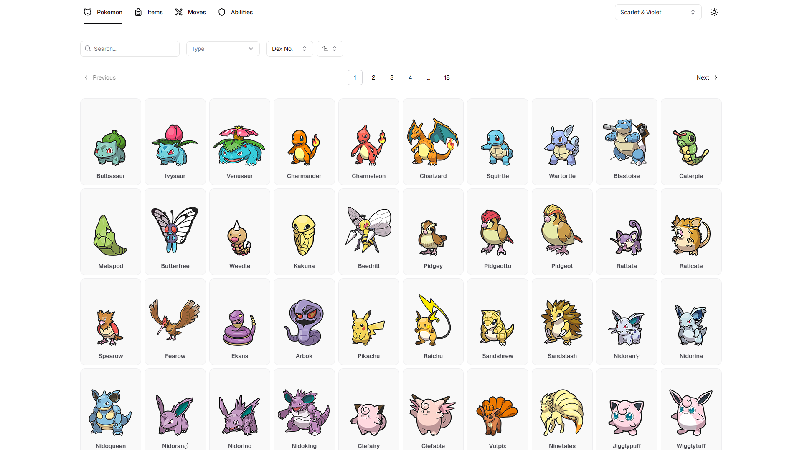
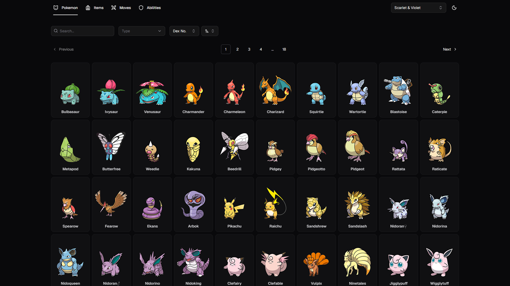
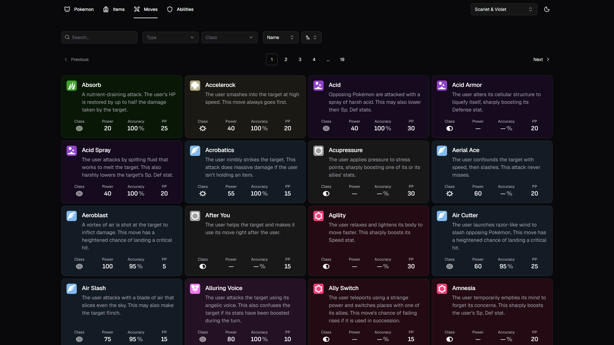
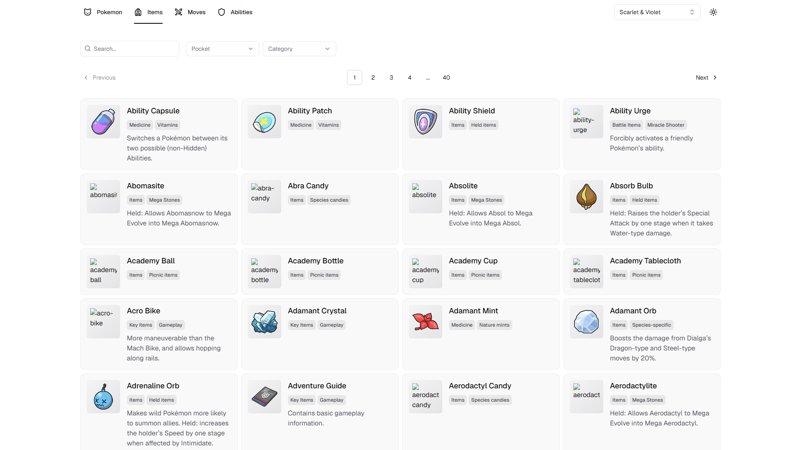
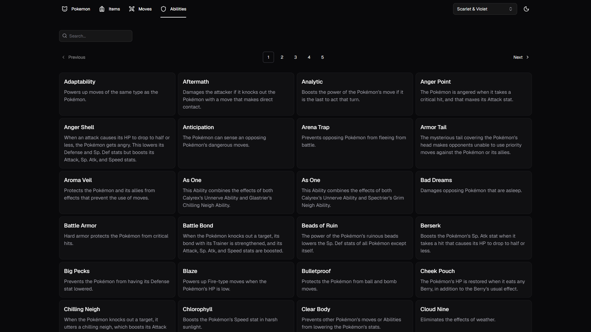
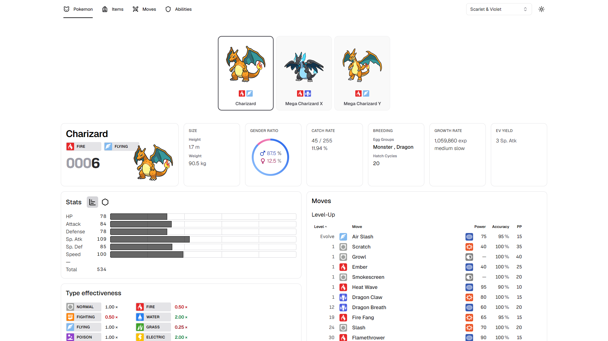
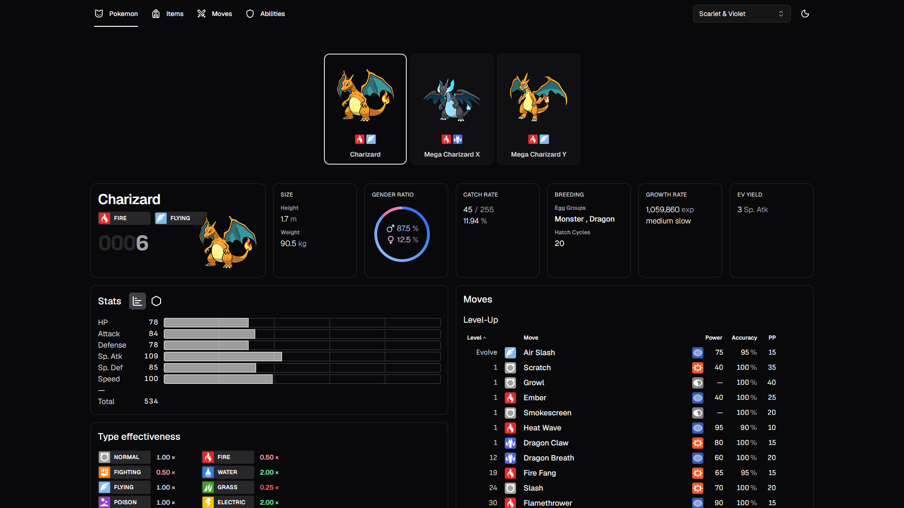
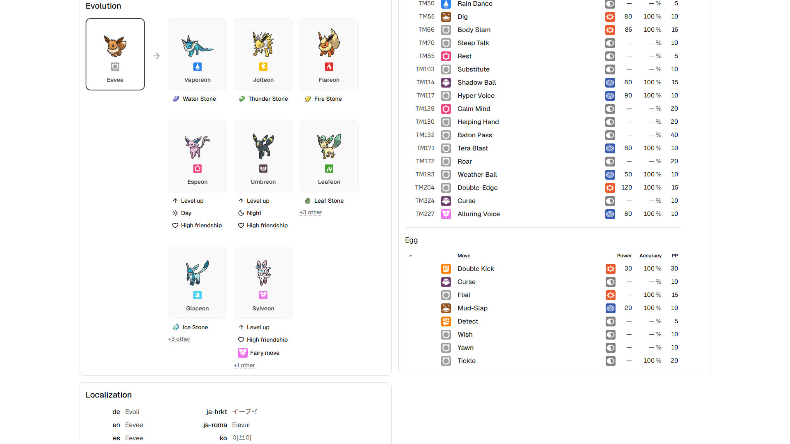

<div align="center">
  
  <h1>Masterball</h1>
  <p>A fast, modern Pokedex for browsing every Pokemon, move, ability, and item from the pokeapi dataset.</p>
</div>

## Overview

Masterball is a Pokedex web app built with Astro, React, and Tailwind CSS. It is a fully static site: every piece of pokeapi data is fetched at build time and baked into static HTML, so production does no server-side rendering and makes no runtime API calls for page data. React islands handle interactivity only (search, filtering, sorting, charts), which keeps pages quick to load and cheap to host.

The catalog covers all 1025 species (plus their alternate forms and variants), along with full browsable indexes for moves, abilities, and items. Each monster has a rich detail page with base stats, type effectiveness, abilities, evolution lines, encounter locations, learnsets, cosmetic forms, and localized names.

## Screenshots

Masterball ships with a light and dark theme. The screenshots below are captured against the full production dataset.

### Species grid

The home page is a searchable, filterable, paginated grid of every species.

| Light                                                                 | Dark                                                                |
| --------------------------------------------------------------------- | ------------------------------------------------------------------- |
|  |  |

### Catalog grids

The same grid foundation powers the moves, items, and abilities sections, each with its own columns, filters, and card layout.

| Moves                                              | Items                                               | Abilities                                                 |
| -------------------------------------------------- | --------------------------------------------------- | --------------------------------------------------------- |
|  |  |  |

### Detail pages

Every monster has a detail page with a variant selector, base stats, type effectiveness, abilities, learnset, evolution tree, encounter locations, and localized names.

| Light                                                                              | Dark                                                                             |
| ---------------------------------------------------------------------------------- | -------------------------------------------------------------------------------- |
|  |  |

The evolution section renders branching trees with their evolution conditions, like every Eevee line shown here.



## Features

- **Full catalog browsing.** Searchable, filterable, sortable, and paginated grids for species, moves, abilities, and items, with state synced to the URL so views are shareable.
- **Rich detail pages.** Base stats, type effectiveness matchups, abilities, learnsets, evolution trees, encounter locations, cosmetic forms, and localized names per monster.
- **Forms and variants.** Alternate forms, regional variants, and mega evolutions are first-class, each with its own route and sprites.
- **Version group aware.** A version group selector scopes move learnsets and other version-specific data to a chosen set of games.
- **Light and dark themes.** Theme preference is applied before first paint to avoid flashes, with a smooth view-transition toggle.
- **Static and fast.** All data is baked in at build time, so production serves static HTML with interactive React islands and no runtime data fetching for page content.

## Tech stack

- **Framework:** Astro 7 (static site generation)
- **Language:** TypeScript 6 (strict, erasable-syntax-only)
- **Styling:** Tailwind CSS 4 (configured through `@tailwindcss/vite`, no `tailwind.config`)
- **UI runtime:** React 19 with the React Compiler, `motion`, and `lucide-react`
- **UI primitives:** Base UI (`@base-ui/react`) for `Select`, `Combobox`, `Dialog`, and `Tabs`
- **Tables:** TanStack Table v9
- **Client state:** TanStack Store
- **Charts:** visx
- **Data source:** pokeapi via `pokedex-promise-v2` (used for its types)
- **Package manager:** pnpm
- **Lint and format:** oxlint and oxfmt

## How it works

All pokeapi data is fetched at build time through a cached client (`src/lib/api/pokeapi.ts`), which exposes `getList`, `getByName`, and `getResource`. Responses go through a process-global in-memory cache (deduplicating repeat requests within a build) with per-request timeouts and retry with backoff. That cache is persisted to disk (`src/lib/api/cache.ts`) so it survives between builds, loaded and saved by the `pokeapi-cache` integration in `astro.config.mjs`. The first full build populates the cache from the network; later builds run almost entirely from disk.

`src/lib/providers.ts` is the single catalog source that decides which resources exist in a build. To keep iteration fast, it returns small or curated lists in development and the full lists in production, so `pnpm dev` builds a representative slice while `pnpm build` produces the complete site.

The only runtime data fetching in production is the moves section, which lazily loads build-generated static JSON (`/data/moves-data.json` and `/data/moves-descriptions.json`) so large learnset and description payloads stay out of the initial page.

## Project structure

- `src/pages/` - Astro routes: `index.astro` (species grid), `[slug]/[...variant].astro` (monster details), `ability`, `item`, `move`, and `data/` (build-time JSON endpoints for the moves section).
- `src/components/`
  - `compounds/` - the generic `CardGrid` plus its `SpeciesCardGrid`, `MoveCardGrid`, `ItemCardGrid`, and `InfoCardGrid` bindings, and cards like `MonsterCard` and `ItemCard`.
  - `details/` - detail-page sections grouped by feature (`stats/`, `moves/`, `abilities/`, `evolution/`, `locations/`, `typeEffectiveness/`, and more).
  - `shared/` - cross-page UI (`SearchBar`, `FilterBar`, `SortBar`, `MobileNav`, `ThemeSwitch`, `VersionGroupSelector`).
  - `ui/` - shared primitives built on Base UI.
- `src/lib/`
  - `api/` - the cached pokeapi client, disk cache persistence, and the client-side moves JSON loader.
  - `domain/` - per-domain registries (types, items, stats, version groups, damage classes) and the build-time fetch-and-shape transforms their detail sections consume.
  - `stores/`, `hooks/`, `utils/`, and `providers.ts`.
- `public/` - static assets (type icons, damage-class icons, favicon).

## Getting started

### Prerequisites

- [pnpm](https://pnpm.io/) 11 or newer

### Install and run

```sh
pnpm install
pnpm dev
```

Visit [http://localhost:4321](http://localhost:4321) to view the app. Development uses a small curated dataset so it starts quickly.

### Build and preview the full site

```sh
pnpm build
pnpm preview
```

`pnpm build` fetches any uncached data, then generates the complete static site (all 1025 species and their forms) into `dist/`. The first build pulls a large amount of data from pokeapi and can take a while; subsequent builds reuse the on-disk cache. `pnpm preview` serves the production build locally.

## Commands

| Command        | Description                           |
| -------------- | ------------------------------------- |
| `pnpm dev`     | Start the dev server (small dataset)  |
| `pnpm build`   | Build the full static site to `dist/` |
| `pnpm preview` | Preview the production build          |
| `pnpm check`   | Run `astro check` (type checking)     |
| `pnpm lint`    | Run oxlint                            |
| `pnpm fmt`     | Run oxfmt                             |

## Data and attribution

All game data comes from [pokeapi](https://pokeapi.co). Pokemon and all related names and assets are trademarks of Nintendo, Game Freak, and The Pokemon Company. This project is a non-commercial fan project and is not affiliated with or endorsed by them.
